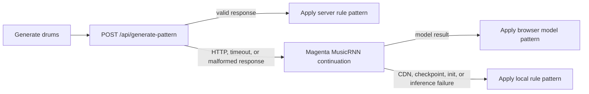

# DM99 AI

DM99 AI is a browser-based drum machine and 32-step electronic-music sequencer. It combines a Web Audio playback and mixing engine, sample-backed and synthesized instruments, deterministic genre pattern generation, and an optional browser-side Magenta fallback.

The “AI” label describes the pattern-assistant workflow. The primary server generator is intentionally deterministic and rule-based; it does not currently call a hosted machine-learning model.

## Features

- 32-step sequencer with per-step activation and pitch controls for tonal instruments.
- 26 instruments: 21 sample-backed instrument slots and five Tone.js synthesizers.
- Techno, house, trance, and drum & bass pattern generation.
- Energy control from `0.0` to `1.0`; server patterns add density in deterministic tiers.
- Genre- and energy-aware bass generation in the browser.
- Optional Magenta MusicRNN drum continuation if the server request fails.
- Synchronous local rule generator if both the server and Magenta are unavailable.
- Procedural Web Audio buffers when a remote sample cannot be fetched or decoded.
- Tempo, swing, master low-pass/high-pass filters, compression, master EQ, and synth/bass EQ.
- Per-instrument volume, mute, solo, and supported ADSR controls.
- Browser-local pattern save/load and keyboard shortcuts.
- Responsive controls for desktop and smaller screens.

## Instruments and audio sources

| Group | Count | Instruments | Playback source |
| --- | ---: | --- | --- |
| Drums | 6 | Kick, Snare, Clap, Tom, Rim, Cow | Procedural Web Audio buffer |
| Cymbals | 4 | Closed hat, Open hat, Crash, Ride | Procedural Web Audio buffer |
| Percussion | 8 | Perc1–Perc6, Shaker, Tambourine | Procedural Web Audio buffer |
| Tonal | 3 | Bass, Acid, Synth | Pitched procedural Web Audio buffer |
| Synth | 5 | Sub, 808, FM, Pluck, AM | Tone.js synthesis |

The 21 sample-backed slots have deterministic procedural buffers by default, so startup and playback do not depend on a third-party sample host. The 14 requested SampleSwap paths remain recorded in the instrument manifest for diagnostics, but remote loading is disabled because those paths are not currently browser-loadable.

Appending `?remoteSamples=1` opts into a best-effort diagnostic mode. In that mode the loader:

1. Fetches each distinct URL with a five-second timeout.
2. Retries a transient network or server failure once.
3. Verifies that the response has an audio-compatible content type.
4. Decodes the response with Web Audio.
5. Creates a deterministic procedural buffer for each affected instrument if any step fails.

The requested SampleSwap paths may return missing or non-audio responses, reject cross-origin browser requests, or change their access policy. Diagnostic mode is not recommended for normal or production use. When a remote request fails, the loading screen reports how many built-in fallbacks are active and playback continues.

### Sample and project licensing

This repository does **not** guarantee that configured third-party samples are royalty-free, redistributable, hotlinkable, or cleared for commercial use. Verify each source file’s current license, provenance, attribution requirements, and hotlink policy before enabling or using remote samples. The default procedural audio is generated locally by the application and does not copy the remote files.

There is currently no project-level `LICENSE` file in this repository. Do not assume the application code is MIT-licensed until the repository owner adds an explicit license.

## Pattern-generation flow

When **Generate drums** is selected, the client follows this order:



The UI reports which source actually produced the pattern. Magenta is a fallback, not the primary generator. On its first use it must initialize the `drum_kit_rnn` checkpoint, which is roughly a 14 MB model download and can be slow or unavailable on restricted networks. Genre affects the rule-built seed rather than being a native MusicRNN input; energy also adjusts the bounded continuation temperature. If Magenta cannot load, the local generator returns immediately.

**Generate bass** is client-side and deterministic. It writes a 32-step Bass pattern using the selected genre, energy level, and either the minor or Phrygian scale.

## Architecture

- `index.html` — static application shell, controls, and CDN script declarations.
- `styles.css` — responsive interface and control styling.
- `script.js` — sequencer state, Web Audio engine, Tone.js instruments, sample loading and fallbacks, persistence, and client-side generation.
- `api/generate-pattern.js` — stateless Vercel Node.js Function for deterministic drum patterns.
- `scripts/dev-server.js` — zero-dependency local static/API development server.
- `scripts/build-static.js` — deterministic Vercel static-output packager.
- `tests/generate-pattern.test.js` — Node test suite for API input handling and generation invariants.
- `vercel.json` — function duration and response security-header configuration.

There is no database, account system, or required third-party API call. The pattern endpoint performs bounded in-memory work and is suitable for low-cost serverless execution.

## Requirements

- Node.js 22.x for parity with the declared Vercel runtime.
- A current browser with Web Audio, `fetch`, `AbortController`, and local storage.

Internet access is optional for the server pattern generator but is needed for remote samples, Tone.js, NexusUI, Google Fonts, and the optional Magenta browser model. Sample instruments retain procedural playback when their remote files fail; the five Tone.js instruments still depend on Tone.js loading successfully.

## Local setup

```bash
git clone https://github.com/jgazcagtz/dm99v2.git
cd dm99v2
npm install
npm test
npm run dev
```

Open the printed `http://127.0.0.1:3000` URL. The zero-dependency development server serves both the static application and the same `/api/generate-pattern` handler exported to Vercel. If only the static files are served by another tool, the client should fall back to Magenta or the local rule generator.

The package also exposes these commands:

```bash
npm test       # Run the Node API/generator test suite
npm run build  # Syntax-check code and prepare the generated public/ output
npm run dev    # Serve the UI and pattern API locally on port 3000
```

### Environment variables

No environment variable is required for the current application.

`.env.local.example` reserves this name for a possible future Hugging Face audio-preview integration:

```dotenv
HUGGINGFACE_API_KEY=
```

The application does not import the Hugging Face SDK or send requests to Hugging Face today. Adding this variable alone does not enable a model or change pattern generation.

## Pattern API

### `POST /api/generate-pattern`

Request headers:

```http
Content-Type: application/json
```

Request body:

```json
{
  "genre": "techno",
  "bpm": 138,
  "energy": 0.7,
  "length": 32
}
```

| Field | Accepted values |
| --- | --- |
| `genre` | `techno`, `house`, `trance`, or `dnb`; common Drum & Bass spellings are normalized to `dnb` |
| `bpm` | Number from 40 through 240 |
| `energy` | Number from 0 through 1 |
| `length` | Whole number from 8 through 64 |

The browser integration always requests 32 steps. The wider API length range exists for direct API consumers.

Successful response, abridged to show its shape:

```json
{
  "success": true,
  "pattern": {
    "kick": [true, false, false, false],
    "snare": [false, false, false, false],
    "hihatClosed": [false, false, true, false]
  },
  "genre": "techno",
  "bpm": 138,
  "energy": 0.7,
  "length": 32,
  "meta": {
    "energyTier": 7,
    "hitCount": 52,
    "generator": "deterministic-rule-based-v2"
  },
  "message": "Pattern generated successfully"
}
```

The actual `pattern` contains nine boolean arrays—`kick`, `snare`, `hihatClosed`, `hihatOpened`, `clap`, `tom`, `perc1`, `perc2`, and `perc3`—and every array has exactly the requested length. For identical normalized inputs, the response pattern is identical. Every 0.1 energy increase adds hits to a 32-step pattern without removing the lower-energy groove.

Example request:

```bash
curl -X POST http://localhost:3000/api/generate-pattern \
  -H "Content-Type: application/json" \
  -d '{"genre":"dnb","bpm":174,"energy":0.8,"length":32}'
```

Error responses are also JSON:

```json
{
  "success": false,
  "code": "INVALID_ENERGY",
  "error": "energy must be between 0 and 1.",
  "details": {
    "field": "energy"
  }
}
```

| Status | Meaning |
| ---: | --- |
| `400` | Invalid JSON or an invalid field |
| `405` | Method other than POST; the response includes `Allow: POST` |
| `413` | Body exceeds 4096 bytes |
| `415` | Content type is not `application/json` |
| `500` | Unexpected server error with implementation details withheld |

## Testing

Run the automated checks:

```bash
npm test
npm run build
```

The Node suite verifies:

- all four genres at the minimum, default, and maximum supported lengths;
- exact boolean-array bounds for all nine generated tracks;
- deterministic repeatability;
- distinct genre foundations;
- increasing density at every 0.1 energy step;
- safe normalization and fail-closed input validation;
- POST, JSON media type, malformed JSON, and body-size handling.

Before a release, also perform browser checks for all 26 instruments, server and fallback pattern sources, tempo/swing playback, mute/solo, save/load, small-screen layout, and console warnings from remote sample or CDN failures.

## Deploying to Vercel

The repository is a static site with one Node.js function. `package.json` declares Node.js 22.x, and `vercel.json` limits `api/*.js` to ten seconds and adds `nosniff`, frame-denial, and referrer-policy headers.

Create a preview deployment from the project root:

```bash
npx vercel
```

After validating the preview, create a production deployment:

```bash
npx vercel --prod
```

Alternatively, import the repository through Vercel’s Git integration and keep the project root at the repository root. No output-directory override or database provisioning is required.

A successful deployment command is not complete runtime proof. Verify the deployed `/` page, make a real JSON POST to `/api/generate-pattern`, test the browser fallback path, and confirm that all instruments either decode a remote sample or report a procedural fallback.

## Current limitations

- The server generator is rule-based, not generative model inference.
- The optional Magenta fallback requires external CDN/checkpoint access and a substantial first-use download.
- SampleSwap URL availability, CORS behavior, hotlink permission, and licensing are not controlled by this project.
- The procedural sample fallback covers the 21 sample-backed slots, not a failure of the Tone.js CDN used by five synths.
- Patterns are saved to one browser-local storage key; there is no cloud sync, multi-user library, or account recovery.
- There is no MIDI import/export, rendered audio export, collaboration, or database.
- The UI is fixed at 32 steps even though the API accepts 8–64 steps.
- Browser autoplay rules may require a user gesture before audible playback.
- Frontend behavior still needs real-browser and real-device verification in addition to the included server tests.

## Credits

- Original DM99 concept and repository: J. Gazca
- Audio engine: Web Audio API and Tone.js
- Pitch controls: NexusUI
- Optional browser model: Magenta MusicRNN
- Configured remote sample source: SampleSwap, subject to its current availability and terms
